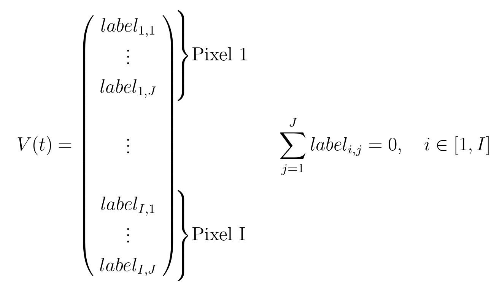
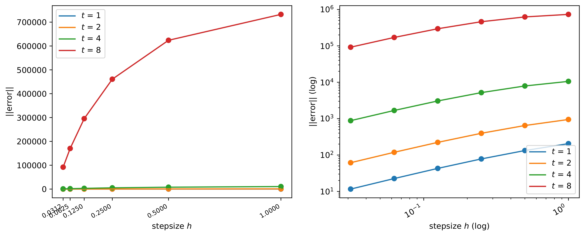
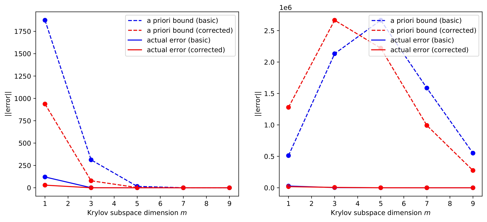
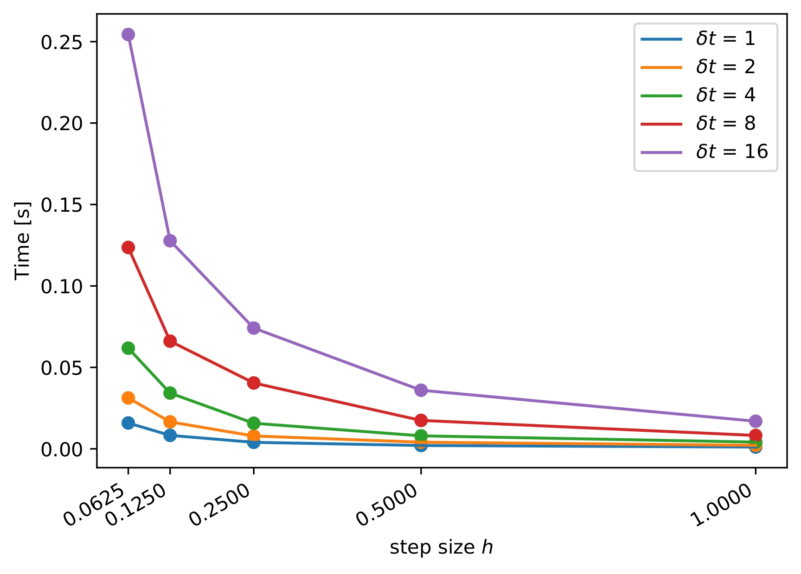
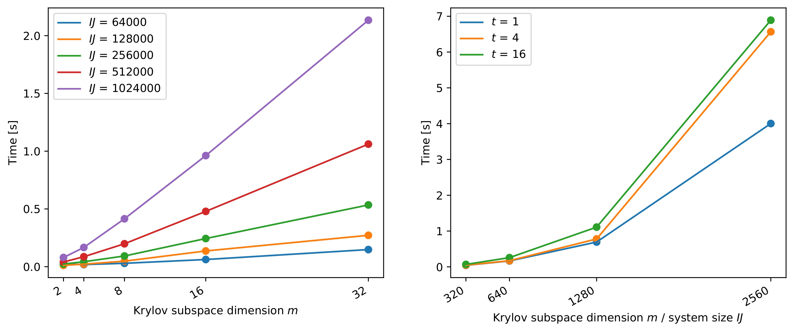

<a name="readme-top"></a>
<div align="center">
  <h3 align="center">Bachelor Thesis</h3>

  <p align="center">
    Comparison of Methods for Integrating Linear Assignment Flows
    <br />
    <!-- <a href="https://github.com/othneildrew/Best-README-Template"><strong>Explore the docs »</strong></a>
    <br />
    <br />
    <a href="https://github.com/othneildrew/Best-README-Template">View Demo</a>
    ·
    <a href="https://github.com/othneildrew/Best-README-Template/issues">Report Bug</a>
    ·
    <a href="https://github.com/othneildrew/Best-README-Template/issues">Request Feature</a>
    -->  
</p>
</div>

<!-- TABLE OF CONTENTS -->
<details>
  <summary>Table of Contents</summary>
  <ol>
    <li>
      <a href="#about-the-project">About The Project</a>
    </li>
    <li>
      <a href="#background">Background</a>
      <ul>
        <li><a href="#linear-assignment-flow">Linear Assignment Flow</a></li>
        <li><a href="#matrix-exponential-and-φ-functions">Matrix Exponential and φ-Functions</a></li>
        <li><a href="#explicit-euler-method">Explicit Euler Method</a></li>
        <li><a href="#krylov-subspace-method">Krylov Subspace Method</a></li>
      </ul>
    </li>
    <li><a href="#comparison">Comparison</a></li>
    <li><a href="#experiments">Experiments</a></li>
    <li><a href="#references">References</a></li>
    <li><a href="#license">License</a></li>
  </ol>
</details>

## About The Project

The objective of this thesis is to evaluate the error and time complexity of both the
Explicit Euler Method and the Krylov Subspace Method, depending on their respective
parameters _step_ _size_ and _subspace_ _dimension_, so we can assess their performance in a
direct comparison.</br>
This repository contains brief explanations and findings as well as all necessary code. For more information, be sure to take a look at the full [document](thesis/thesis.pdf).

## Background
This section will cover the background of the thesis very briefly.
### Linear Assignment Flow
[Implementation](laf.py)</br>
The Linear Assignment Flow (Zeilmann et al., 2020) is represented by an ODE on the
tangent space
```math
\mathcal{T}_0 = \{T \in \mathbb{R}^{I\times J}: T\mathbb{1}=\mathbb{0}\}
``` 
at the barycenter of the assignment Manifold
```math
\mathcal{W}=\{W \in \mathbb{R}^{I\times J}: W_{i,j} > 0, W\mathbb{1}=\mathbb{1}\}
``` 
meaning that every row of $W\in \mathcal{W}$ represents a pixel and every column a label. The
resulting entries then represent the probability of pixel $i$ being mapped to label $j$, so
that every row sums up to 1.
It is represented by an ODE of the form
```math
\dot V(t) = A\:V(t)+b, \quad V(0)=0\in \mathbb{R}^{IJ}
``` 
where 
* $V(t) \in \mathcal{T}_0$ is our tangent vector 
<p align="center"></p>

* $A \in \mathbb{R}^{IJ\times IJ}$ represents the weights in pixel neighborhood
* $b \in \mathbb{R}^{IJ}$ carries the image data

For a standard sized image of $500\times500$ pixels and 5 prototypes, the system will result
in the dimension
```math
\mathbb{R}^{1\,250\,000} = \mathbb{R}^{1\,250\,000\times 1\,250\,000} \cdot \mathbb{R}^{1\,250\,000}
```
so sparse matrix representations have to be used.

### Matrix Exponential and φ-Functions
For a matrix $A \in \mathbb{R}^{n\times n}$ we define the matrix exponential to be the $n\times n$ matrix
```math
e^{A}=\sum_{j=0}^{\infty}\frac{A^{j}}{j!}.
```
The φ-Functions represent special cases of the Mittag-Leffler Function and have the form
```math
\varphi_{0}(z) = e^{A},\quad \varphi_{1}(A) = \frac{e^{A}-\mathbb{I}}{A}, \quad \varphi_{p}(A)=\frac{\varphi_{p-1}(A)-\varphi_{p-1}(0)}{A}
```
or as Taylor-Series
```math
\varphi_{p}(A)=\sum_{k=0}^{\infty}\frac{A^k}{(k+p)!}, \: \forall p \in \mathbb{N}_0.
```
The solution of an inhomogeneous ODE is given by
```math
x(t) = \varphi_{0}(tA)x_{0}+t\cdot \varphi_{1}(tA) b
```
respectively
```math
x(t) = t\cdot \varphi_{1}(tA)b
```
if $x_0=0$.
### Explicit Euler Method
[Implementation](euler.py)</br>
The Explicit Euler Method (also called ”forward Euler“) is the most basic method to solve an ODE.
It is calculated iteratively by
```math
x_{n+1} = x_n + (Ax_n + b)h.
```
where $h$ is a step size.
### Krylov Subspace Method
[Implementation](krylov.py)</br>
The Krylov Subspace Method (Niesen and Wright, 2012, pp. 4-6) is a more advanced method than the Explicit Euler Method. It tries to approximate $\varphi_p(A)x$ which lives in $\mathbb{R}^n$ by using the Krylov Subspace
```math
\mathcal{K}_m(A, x) = span\{x, Ax, A^2x, \ldots, A^{m-1}x\}, \quad m \leq n. 
```
By orthonormalizing it, we get 
```math
\mathcal{K}_m(A, x) = span\{v_1, v_2, \ldots, v_m\}.
```
These basis vectors combined, form the matrix $V_m \in \mathbb{R}^{n\times m}$ such that
```math
AV_m = V_mH_m + h_{m, m+1}v_{m+1}e_m^T
```
respectively
```math
H_m = V_m^TAV_m, \quad A \approx V_mH_mV_m^T
```
where $e_m$ is a vector in the standard basis and $H_m$ is a small Hessenberg matrix $\in \mathbb{R}^{m\times m}.$
Approximating $A$ in this way is very useful to calculate the the $\varphi$-Funtions, because
```math
\varphi_p(A)x \approx \varphi_p(V_mH_mV_m^T)x = V_m\varphi_p(H_m)V_m^Tx,
```
so the matrix exponential does not have to be calculated on a very big matrix anymore, but instead one of size $m\times m$.

## Comparison
### Error Estimation
The global error of the Explicit Euler Integration has an upper bound
```math
\Vert \epsilon_{n} \rVert \leq \frac{h \:\max\Vert \ddot{x} \rVert}{2}\frac{e^{t_nL_f}-1}{L_f}
```
so it shrinks linearly with $h$, at least for small $h$.</br>

The Krylov Subspace Methods a priori error has an upper bound

```math
\epsilon \leq 2 \beta \frac{(\tau \rho)^m e^{\tau \rho}}{m!}, \: \rho = \lVert A \rVert, \beta = \lVert x \rVert.
```
and in the Linear Assignment Flow $\lVert A \rVert = 1$, so it further simplifies to
```math
\epsilon \leq 2 \beta \frac{\tau^m e^{\tau}}{m!}.
```
So its a priori error shrinks factorially with $m$.</br>
More info on the possible error correction and the estimation of an a posteriori error are the full document.

### Time Complexity
Parameters:
* $I$: Number of pixels, $J$: Number of labels
* $m$: Krylov Subspace Dimension
* $h$: step size
* $t$: total integrated distance
* $q$: degree of the Padé approximation (small)
* $s$: number that is needed to bring the spectral radius of $A$ below 0.5 by $A/2^s$ (small)


The Complexity of the Explicit Euler Method lies in 
```math
\mathcal{O}\left(\frac{t\: IJ}{h}\right)
```
so it shrinks inversely proportional with the step size.</br>
The Complexity of the Krylov Subspace Method lies in 
```math
\mathcal{O}\left(mIJ+(q+s)m^3\right)
```
when the Lanczos Iteration can be used for orthonormalization. Because the usually high number of pixels the left term dominates the right one and the methods complexity grows linearly proportional with $m$.

## Experiments
As can be seen in the following, the experiments support the theoretical findings.

### Error Estimation
For small $h$ the error of the Explicit Euler Method grows linearly.
<p align="center"> </br><em>(Euler) Error for varying step size h. left: linear, right: log</em></p>

The error of the Krylov Subspace Method shrinks factorially fast with $m$ and also for a larger $t$ we can choose a $m$ that is several order smaller than $IJ$.
<p align="center"> </br> <em> (Krylov) A priori bounds and the actual error for t = 1 (left) and t = 5
(right)</em></p>

### Time Complexity
For a growing step size, the run time of the Explicit Euler Method shrinks inversely proportional.
<p align="center"></br><em>(Euler) Run times for varying h and a fixed IJ</em></p>

The run time of the Krylov Subspace Method grows linearly with $m$ if $m \ll IJ$. When they are similar, the run time grows exponentially.
<p align="center"></br><em>(Krylov) Run times for varying m, if m ≪ IJ (left) and m = IJ (right)</em></p>

## References
* Zeilmann, A., Savarino, F., Petra, S., and Schnörr, C. (2020). Geometric numerical
integration of the assignment flow. Inverse Problems</br>
* Niesen, J. and Wright, W. M. (2012). Algorithm 919. ACM Transactions on Mathematical Software

## License
Distributed under the MIT License. See `LICENSE` for more information.

<p align="right">(<a href="#readme-top">back to top</a>)</p>
